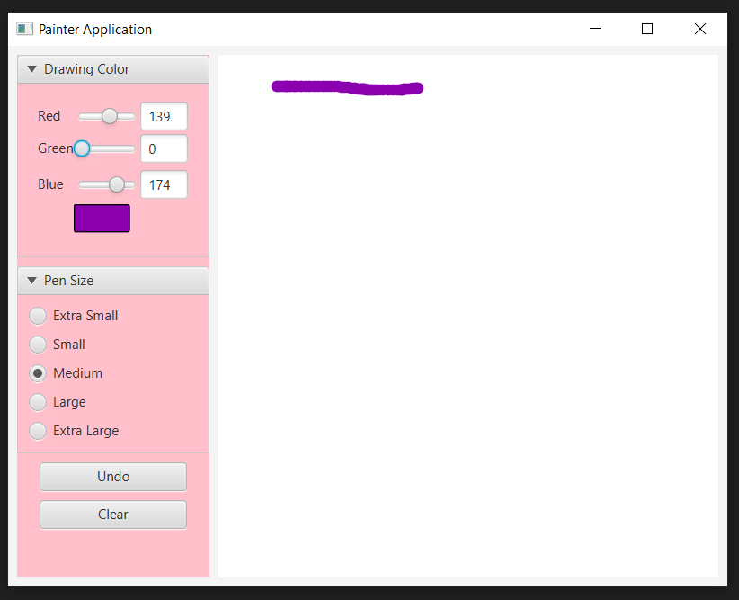

# Painter Application using Javafx and SceneBuilder 

##

# Software:
## JavaFX SDK 11.0.2 ( https://openjfx.io/)
## Scene Builder 11.0.0 (https://gluonhq.com/products/scene-builder/)
## IntelliJ IDEA ( https://www.jetbrains.com/idea/
##
## Instruction to set up: (https://openjfx.io/openjfx/docs/#introduction)
#
## For VM options :--module-path ${PATH_TO_JAVAFX} --add-modules javafx.controls,javafx.fxml ;${PATH_TO_JAVAFX} - path to JavaFX library 
 

#

#

#

#

#
## Author: Ozar Aini
